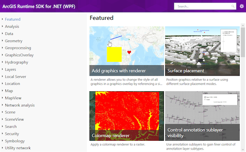

# ArcGIS Maps SDK for .NET - Samples

**Interactive samples demonstrate the ArcGIS Maps SDK for .NET API**

## Get started

If you're on Windows, the easiest way to get started is to download the viewer from the Microsoft Store:

Or, you can browse a searchable list of samples on the ArcGIS for developers website:

[-202020?style=flat-square&labelColor=gray&logo=windows)](https://developers.arcgis.com/net/uwp/sample-code/)

### Build the samples locally

If you want to modify or debug sample code, you can clone this repo and load one of the following solutions:

- All: `src\ArcGIS.Viewers.All.sln`
- .NET MAUI (iOS, Android): `src\MAUI\ArcGIS.Samples.Maui.sln`

If you are only interested in one platform, you can open a platform-specific solutions:

- [WPF .NET Framework](src/WPF/readme.md): `src\WPF\WPF.Viewer.NetFramework.sln`
- [WPF .NET](src/WPF/readme.md): `src\WPF\WPF.Viewer.Net.sln`
- [.NET MAUI](src/MAUI/readme.md): `src\MAUI\ArcGIS.Samples.Maui.sln`
- [WinUI](src/WinUI/readme.md): `src\WinUI\ArcGIS.WinUI.Viewer.sln`

The following platforms are being kept for reference, but no new sample implementations are being added:

- [UWP](src/UWP/readme.md): `src\Windows\ArcGIS.UWP.Viewer.sln`

## Notes

> **IMPORTANT** When you run the samples, you will need to provide an API key. You can get a free developer account and key on the [ArcGIS Developers website](developers.arcgis.com). For more information see https://links.esri.com/arcgis-runtime-security-auth.

- The .NET sample viewers have a prompt for setting an API key. You can also hardcode your API key in the [`GetLocalKey() method`](https://github.com/Esri/arcgis-maps-sdk-dotnet-samples/blob/main/src/Samples.Shared/Managers/ApiKeyManager.cs#L112) of the [`ApiKeyManager class`](https://github.com/Esri/arcgis-maps-sdk-dotnet-samples/blob/main/src/Samples.Shared/Managers/ApiKeyManager.cs).
- Before using WinUI, install the [latest Windows SDK](https://developer.microsoft.com/en-us/windows/downloads/windows-sdk/) and the [vsix plugin](https://aka.ms/windowsappsdk/stable-vsix-2022-cs).
- When compiling Universal Windows Platform or WinUI samples, make sure that you are compiling against x86/x64/ARM platform and not using AnyCPU.

### Offline data

Several samples require local data to function properly. That data is downloaded to local storage automatically when a sample is run.
This process is handled by the `DataManager` class (located in the 'Managers' folder in each viewer project). Samples
that use the data manager to download their data are differentiated as follows:

- They have `RequiresOfflineData` set to true in their metadata.json files
- They have one or more entries under `DataItemIds` in their metadata.json files (these are portal item Ids)
- They use the data manager to identify the correct path for their offline files at run time

See the [contribution guidelines](https://github.com/Esri/arcgis-maps-sdk-dotnet-samples/wiki/Contributing) for more detailed information.

### Requirements

[Supported system configurations for ArcGIS Maps SDK for .NET](https://developers.arcgis.com/net/reference/system-requirements/)

### Tools

Esri uses several tools to more efficiently manage the content in this repo. See [Tools](tools/readme.md) for more information.

## Contribute

Anyone and everyone is welcome to [contribute](https://github.com/Esri/arcgis-maps-sdk-dotnet-samples/wiki/Contributing).

## License

Copyright 2022 Esri

Licensed under the Apache License, Version 2.0 (the "License");
you may not use this file except in compliance with the License.
You may obtain a copy of the License at

https://www.apache.org/licenses/LICENSE-2.0

Unless required by applicable law or agreed to in writing, software
distributed under the License is distributed on an "AS IS" BASIS,
WITHOUT WARRANTIES OR CONDITIONS OF ANY KIND, either express or implied.
See the License for the specific language governing permissions and
limitations under the License.

A copy of the license is available in the repository's [license.txt](/license.txt) file.
