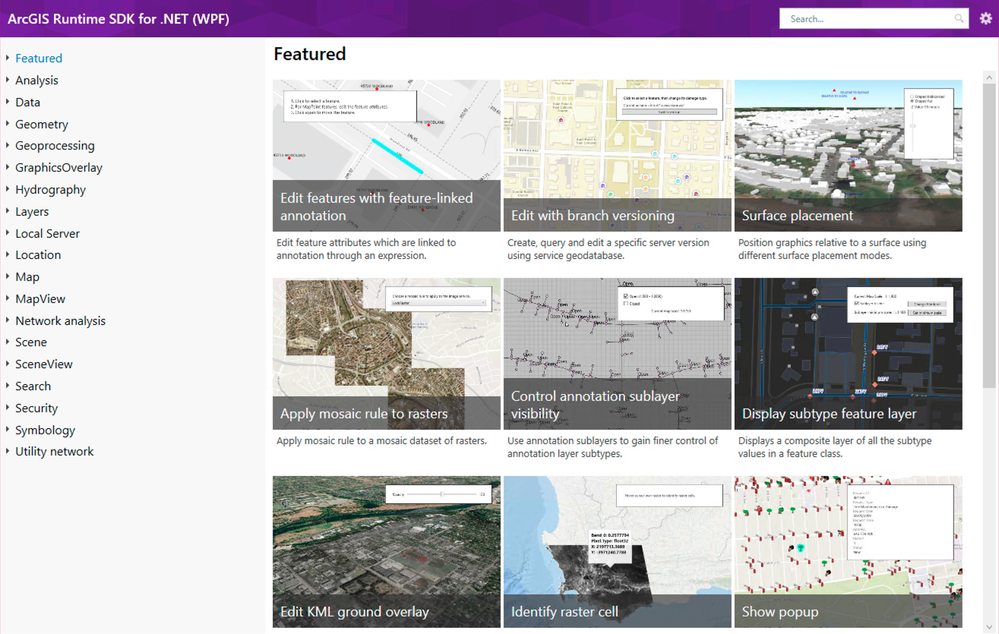

# ArcGIS Runtime SDK for .NET - Samples

 

  

**Interactive samples demonstrate the ArcGIS Runtime API**

## Get started

If you're on Windows, the easiest way to get started is to download the viewer from the Microsoft Store:

Or, you can browse a searchable list of samples on the ArcGIS for developers website:

 

### Build the samples locally

If you want to modify or debug sample code, you can clone this repo and load one of the following solutions:

- All: `src\ArcGISRuntime.Viewers.All.sln`
- Windows ( WPF / UWP ): `src\ArcGISRuntime.Viewers.Windows.sln`
- Xamarin (iOS, Android, Forms): `src\ArcGISRuntime.Viewers.Xamarin.sln`
- WinUI (Preview): `src\WinUI\ArcGISRuntime.WinUI.Viewer.sln`

## Notes

> **IMPORTANT** When you run the samples, you will need to provide an API key. You can get a free developer account and key on the [ArcGIS Developers website](developers.arcgis.com). For more information see https://links.esri.com/arcgis-runtime-security-auth.

### Offline data

Several samples require local data to function properly. That data is downloaded to local storage automatically when a sample is run.
This process is handled by the `DataManager` class (located in the 'Managers' folder in each viewer project). Samples
that use the data manager to download their data are differentiated as follows:

- They have `RequiresOfflineData` set to true in their metadata.json files
- They have one or more entries under `DataItemIds` in their metadata.json files (these are portal item Ids)
- They use the data manager to identify the correct path for their offline files at run time

See the [contribution guidelines](https://github.com/Esri/arcgis-runtime-samples-dotnet/wiki/Contributing) for more detailed information.

### Requirements

[Supported system configurations for ArcGIS Runtime API for .NET](https://developers.arcgis.com/net/reference/system-requirements/)

### Tools

Esri uses several tools to more efficiently manage the content in this repo. See [Tools](tools/readme.md) for more information.

## Contributing

Anyone and everyone is welcome to [contribute](https://github.com/Esri/arcgis-runtime-samples-dotnet/wiki/Contributing).

## License

Copyright 2021 Esri

Licensed under the Apache License, Version 2.0 (the "License");
you may not use this file except in compliance with the License.
You may obtain a copy of the License at

https://www.apache.org/licenses/LICENSE-2.0

Unless required by applicable law or agreed to in writing, software
distributed under the License is distributed on an "AS IS" BASIS,
WITHOUT WARRANTIES OR CONDITIONS OF ANY KIND, either express or implied.
See the License for the specific language governing permissions and
limitations under the License.

A copy of the license is available in the repository's [license.txt](/license.txt) file.