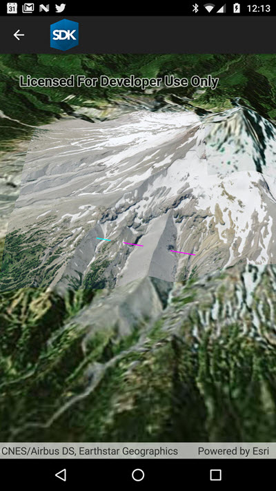

# Line of sight from location

This sample demonstrates a `LocationLineOfSight` analysis that shows segments that are visible or obstructed along a line drawn from observer to target.

## Instructions

Click to define a location for the observer, then again to define the target. The result will show visible segments in cyan and obstructed ones in magenta.
