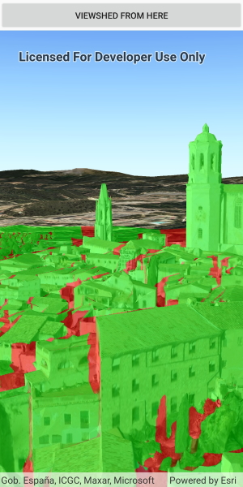

# Viewshed for camera

This sample demonstrates how to create a `LocationViewshed` to display interactive viewshed results in the scene view. The viewshed observer is defined by the scene view camera to evaluate visible and obstructed areas of the scene from that location.

