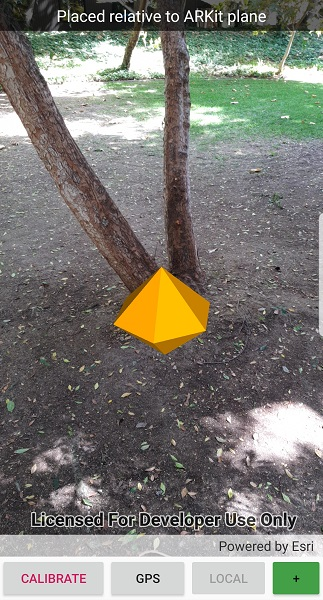

# Collect data in AR

Tap on real-world objects to collect data.

## Use case

You can use AR to quickly photograph an object and automatically determine the object's real-world location, facilitating a more efficient data collection workflow. For example, you could quickly catalog trees in a park, while maintaining visual context of which trees have been recorded - no need for spray paint or tape.

## How to use the sample

Before you start, go through the on-screen calibration process to ensure accurate positioning of recorded features.

When you tap, an orange diamond will appear at the tapped location. You can move around to visually verify that the tapped point is in the correct physical location. When you're satisfied, tap the '+' button to record the feature. An image from the camera feed will automatically be attached to the recorded feature.

> &#9888; **WARNING**: collection of photos is completely automatic; consider your surroundings when adding features.

## How it works

1. Create an `ARSceneView`. Set the atmosphere effect to `None` and the space effect to `None`. Create and show a scene in the scene view.
2. Load the feature service and display it with a feature layer.
3. Create and add the elevation surface to the scene.
4. Create a graphics overlay for planning the location of features to add. Configure the graphics overlay with a renderer and add the graphics overlay to the scene view.
5. When the user taps the screen, use `ARSceneView.ARScreenToLocation` to find the real-world location of the tapped object using ARKit/ARCore plane detection.
6. Add a graphic to the graphics overlay preview where the feature will be placed and allow the user to visually verify the placement.
7. When the user presses the button, take the current AR frame from `ARSceneView.ArSceneView.ArFrame.AcquireCameraImage()`. Rotate the image appropriately and convert it to a JPEG for efficient storage.
8. Prompt the user for a tree health value, then create the feature. Upon successful creation of the feature, use `feature.AddAttachment` to add the image.

## Relevant API

* ARSceneView
* GraphicsOverlay
* SceneView
* Surface

## About the data

The sample uses a publicly-editable sample [tree survey feature service](https://arcgisruntime.maps.arcgis.com/home/item.html?id=8feb9ea6a27f48b58b3faf04e0e303ed). You can use AR to quickly record the location and health of a tree while seamlessly capturing a photo.

## Additional information

This sample requires a device that is compatible with ARKit 1 on iOS or ARCore 1.8 on Android.

There are two main approaches for identifying the physical location of tapped point:

* **ARSceneView.ARScreenToLocation** - uses plane detection provided by ARKit/ARCore to determine where _in the real world_ the tapped point is.
* **SceneView.ScreenToLocation** - determines where the tapped point is _in the virtual scene_. This is problematic when the opacity is set to 0 and you can't see where on the scene that is. Real-world objects aren't accounted for by the scene view's calculation to find the tapped location; for example tapping on a tree might result in a point on the basemap many meters away behind the tree.

This sample only uses the `ARScreenToLocation` approach, as it is the only way to get accurate positions for features not directly on the ground in real-scale AR.

Note that unlike other scene samples, a basemap isn't shown most of the time, because the real world provides the context. Only while calibrating is the basemap displayed at 50% opacity, to give the user a visual reference to compare to.

**Real-scale AR** is one of three main patterns for working with geographic information in augmented reality. See [Augmented reality](https://developers.arcgis.com/net/scenes-3d/display-scenes-in-augmented-reality/) in the guide for more information.

See the 'Edit feature attachments' sample for more specific information about the attachment editing workflow.

This sample uses a combination of two location data source modes: continuous update and one-time update, presented as 'roaming' and 'local' calibration modes in the app. The error in the position provided by ARKit/ARCore increases as you move further from the origin, resulting in a poor experience when you move more than a few meters away. The location provided by GPS is more useful over large areas, but not good enough for a convincing AR experience on a small scale. With this sample, you can use 'roaming' mode to maintain good enough accuracy for basic context while navigating a large area. When you want to see a more precise visualization, you can switch to 'local' (ARKit/ARCore-only) mode and manually calibrate for best results.

## Tags

attachment, augmented reality, capture, collection, collector, data, field, field worker, full-scale, mixed reality, survey, world-scale