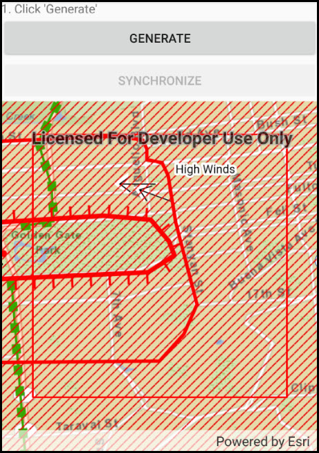

# Edit and sync features

This sample demonstrates how to synchronize offline edits with a feature service.

## Instructions

1. Pan and zoom to the area you would like to download features for, ensuring that all features are within the rectangle.
2. Tap the 'generate' button. This will start the process of generating the offline geodatabase.
3. Tap on a point feature within the area of the generated geodatabase. Then tap on the screen (anywhere within the range of the local geodatabase) to move the point to that location.
4. Tap the 'Sync Geodatabase' button to synchronize the changes back to the feature service.

 Note that the basemap for this sample is downloaded from ArcGIS Online automatically.
