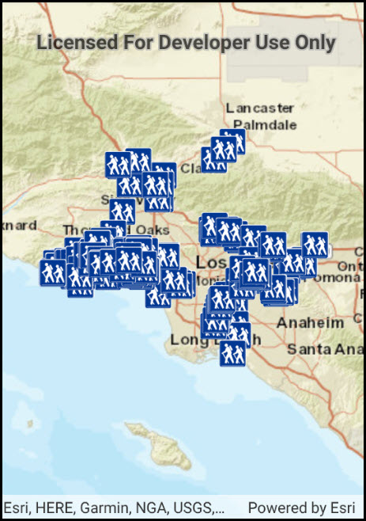

# Feature layer (geodatabase)

Display features from a local geodatabase.

## Use case

Useful for applications which consume data maintained by a local source 
(e.g. a geodatabase) on the device running the application.

## How to use the sample

Run the app.

## How it works

1. Create a geodatabase using the provided local resource, `new Geodatabase(geodatabaseResourceUrl)`.
2. Wait for geodatabase to load.
3. Get the 'Trailheads' `GeodatabaseFeatureTable` from the geodatabase, `Geodatabase.GeodatabaseFeatureTable(tableName)`.
4. Create feature layer using the table from above, `new FeatureLayer(geodatabaseFeatureTable)`.
5. Add feature layer to `Map` with `Map.OperationalLayers.Add(featureLayer)`.

## Relevant API

* FeatureLayer
* Geodatabase
* GeodatabaseFeatureTable

## Offline data

This sample downloads the following items from ArcGIS Online automatically:

* [LosAngeles.vtpk](https://www.arcgis.com/home/item.html?id=d9f8ce6f6ac84b90a665a861d71a5d0a) - Streets Vector Tile Package (vtpk) for the City of Los Angeles.
* [LA_Trails.geodatabase.zip](https://www.arcgis.com/home/item.html?id=2b0f9e17105847809dfeb04e3cad69e0) - Mobile geodatabase containing LA trailhead locations

## Additional information

One of the ArcGIS Runtime data set types that can be accessed via the local storage (i.e. hard drive, flash drive, micro SD card, USB stick, etc.) of the device is a mobile geodatabase. One of the primary advantages of the mobile geodatabase is that it allows users to access feature data in their map without having to be connected to the internet. A mobile geodatabase can be provisioned for use in an ArcGIS Runtime application by ArcMap. The following provide some helpful tips on how to create a mobile geodatabase file:

In ArcMap, choose File > Share As > ArcGIS Runtime Content from the menu items to create the .geodatabase file (see the document: http://desktop.arcgis.com/en/arcmap/latest/map/working-with-arcmap/creating-arcgis-runtime-content.htm). 

Note: You could also use the 'Services Pattern' and access the Geodatabase class via a Feature Service served up via ArcGIS Online or ArcGIS Enterprise. Instead of using the Geodatabase class to access the .geodatabase file on disk, you would use GeodatabaseSyncTask point to a Uri instead. For more information review the document: https://developers.arcgis.com/net/latest/wpf/guide/create-an-offline-layer.htm.

## Tags

geodatabase, mobile, offline
