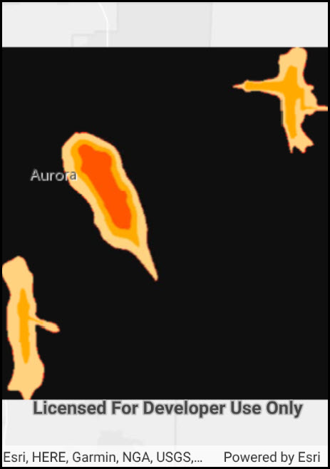

# Raster layer (GeoPackage)

Open a GeoPackage, obtain a raster from the package, and display the table as a `RasterLayer`.

## How it works

1. Create a `GeoPackage` by passing the path to a `.gpkg` file stored locally on the device.
2. Load the `GeoPackage` with `.LoadAsync()`.
3. Wait for the package to load.
4. Create a `RasterLayer` by obtaining the first `Raster` in the list of `.GeoPackageRasters`, and passing that `Raster` to the `RasterLayer`.
5. Finally, add the `RasterLayer` the Map's operational layers.

## Relevant API

* GeoPackage
* GeoPackageRaster
* RasterLayer

## Offline data

This sample downloads the following items from ArcGIS Online automatically:

* [AuroraCO.zip](https://www.arcgis.com/home/item.html?id=68ec42517cdd439e81b036210483e8e7) - GeoPackage with datasets that cover Aurora Colorado: Public art (points), Bike trails (lines), and Subdivisions (polygons), Airport noise (raster), Buildings (raster).

## Tags

Layers, OGC, container, geopackage, package, raster
