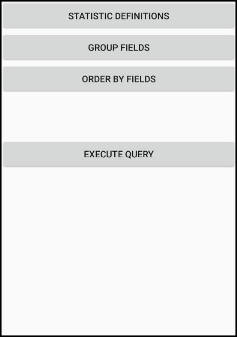

# Statistical query with group and sort

This sample demonstrates how to query a feature table to get statistics for one or more specified fields. The sample queries a service feature table of US states to get the selected statistics. The results can be grouped and sorted using one or several fields in the table.

### Instructions

 - Select a combination of fields and statistic types to include in the query.    
 - (Optional) Choose one or more fields to group the results on. Grouping by SUB_REGION, for example, will show results grouped (summarized) for each region ('Pacific', 'Mountain', etc).
 - (Optional) Choose one or more fields to order results by. Only those fields selected for grouping are valid choices for ordering results.
 - Execute the query. Results will be displayed in a hierarchical view that is grouped and sorted according to the chosen fields.
