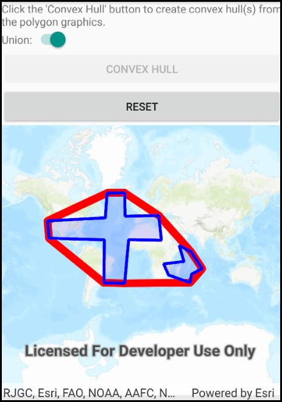

# Convex hull list

This sample demonstrates how to use the GeometryEngine.ConvexHull to generate convex hull polygon(s) from multiple input geometries.

## Use case

Creating a convex hull is an important concept in GIS as it allows for proximity analysis to define the smallest polygon possible that encloses a group of geometric shapes. For example, suppose you wanted to know the containment area of a hazardous waste site where multiple barrels of radioactive material were buried in the ground. The first step in this proximity analysis would be to generate the convex hull polygon that encloses the toxic barrels.  A visual analogy would be something like driving numerous nails in a board and then snapping a rubber-band on the outer-most nails (i.e. the convex hull).

## How to use the sample

Click the 'Create Convex Hull' button to create convex hull(s) from the polygon graphics. If the 'Union' checkbox is checked, the resulting output will be one polygon being the convex hull for the two input polygons. If the 'Union' checkbox is un-checked, the resulting output will have two convex hull polygons - one for each of the two input polygons. Click the 'Reset' button to start over.

## How it works

The static method, `GeometryEngine.ConvexHull`, is called by passing in a list of polygon geometries and a boolean to union the result is desired. The two input polygons geometries are hard-coded as part of the samples initialization. To improve the visualization of the generated convex hull polygon(s), the input polygons and generated convex hull polygon can be assigned to individual graphics overlays. Alternatively, the Graphic.ZIndex property can be used to control the order in which the graphics are drawn in the GraphicsOverlay.

## Relevant API

* GeometryEngine.ConvexHull
* Graphic.ZIndex
* GraphicsOverlay

## Tags

Analysis, ConvexHull, GeometryEngine
