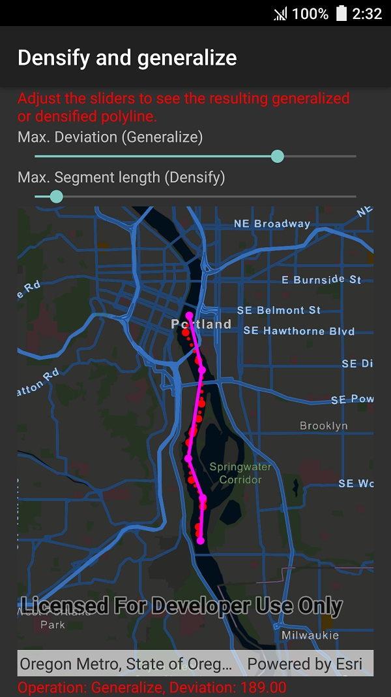

# Densify and generalize

This sample demonstrates how to densify or generalize a polyline geometry. In this example, points representing a ship's location are shown at irregular intervals. You can densify the polyline to interpolate points along the line at regular intervals. Generalizing the polyline can also simplify the geometry while preserving its general shape.

## Instructions

Use the sliders to adjust the max deviation (for generalize) and the max segment length (for densify). The results will update automatically.
