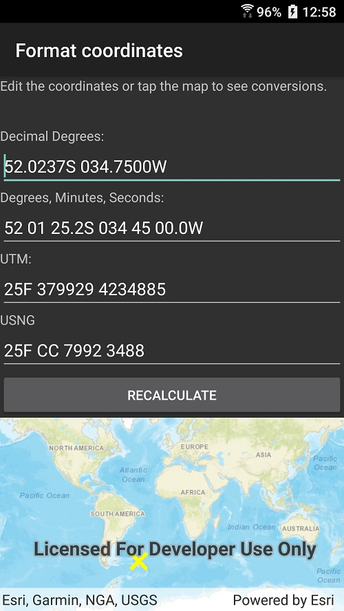

# Format coordinates

This sample demonstrates how to convert between `MapPoint` and string representations of a point using various coordinate systems.

## Instructions

Tap on the map to see the point in several coordinate systems. Update one of the coordinates and select 'recalculate' to see the point converted into other coordinate systems. 
