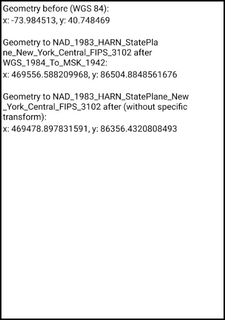

# Project with specific transformation

This sample demonstrates how to use the GeometryEngine with a specified geographic transformation to transform a geometry from one coordinate system to another. 

## Instructions

See [Coordinate Systems and Transformations](https://developers.arcgis.com/net/latest/wpf/guide/coordinate-systems-and-transformations.htm) for more information about geographic coordinate systems, geographic transformations, and projected coordinate systems. 
