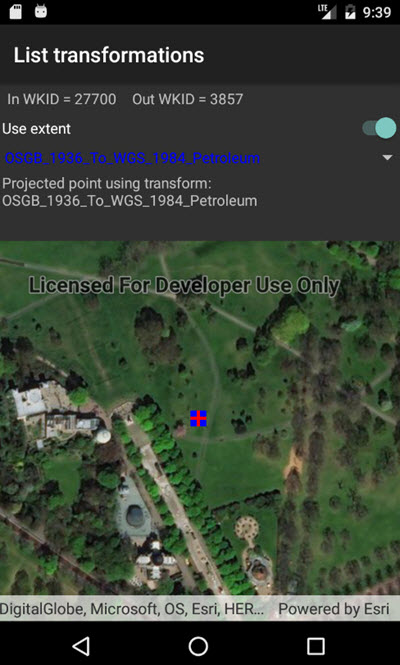

# List transformations by suitability

This sample demonstrates how to use the TransformationCatalog to get a list of available DatumTransformations that can be used to project a Geometry between two different SpatialReferences, and how to use one of the transformations to perform the GeometryEngine.project operation. The TransformationCatalog is also used to set the location of files upon which grid-based transformations depend, and to find the default transformation used for the two SpatialReferences.

## Instructions

Tap on a listed transformation to re-project the point geometry (shown with a blue square) using the selected transformation. The reprojected geometry will be shown in red. If there are grid-based transformations for which projection engine files are not available locally, these will be shown in gray in the list. The default transformation is shown in bold. To download the additional transformation data, log on to your developers account (http://developers.arcgis.com), click the 'Download APIs' button on the dashboard page, and download the 'Coordinate System Data' archive from the 'Supplemental ArcGIS Runtime Data' tab. Unzip the archive to the 'SampleData' sub-folder of the ApplicationData directory, which can be found for each platform at run time with System.Environment.GetFolderPath(System.Environment.SpecialFolder.ApplicationData).
