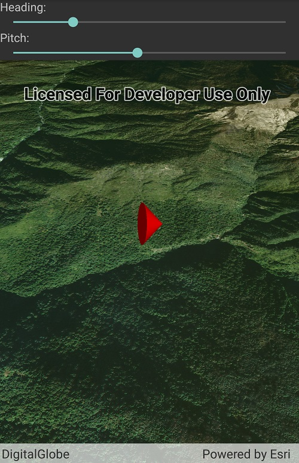

# Scene properties expressions

Update the orientation of a graphic using scene property rotation expressions.

## How to use the sample

Use the sliders to adjust the heading and pitch properties for the graphic.

## How it works

Simple renderers can dynamically update the positions of graphics using an expression. The expression relates a renderer property to one of the graphic's attribute keys.

1. Create a new graphics overlay.
2. Create a simple renderer and set its scene properties.
    1. Set the heading expression to **[HEADING]**.
3. Apply the renderer to the graphics overlay.
4. Create a point graphic and add it to the overlay.
5. To update the graphic's rotation, update the **HEADING** or **PITCH** property in the graphic's attributes.

## Relevant API

* GraphicsOverlay
* SimpleRenderer
* SceneProperties
* SimpleRenderer.SceneProperties
* SceneProperties.HeadingExpression
* Graphic.Attributes

## About the data

The sample shows an empty scene with a point graphic and an imagery basemap.

## Tags

rotation, expression, heading, pitch, scene, 3D, symbology