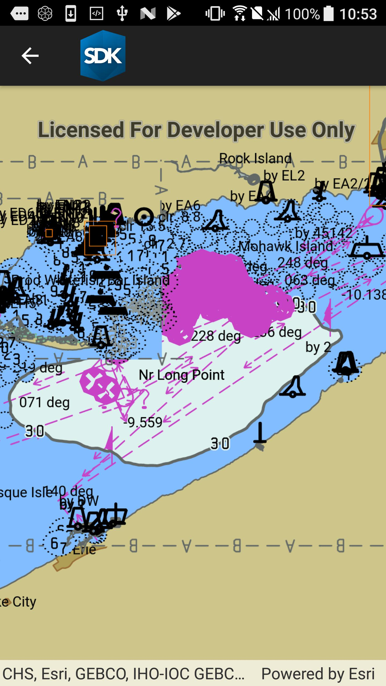

# Add ENC Exchange Set

This sample demonstrates how to load an ENC Exchange Set, including its component cells.

## Instructions

This sample automatically downloads ENC data from ArcGIS Online before displaying the map.
