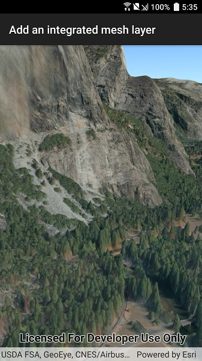

# Add an integrated mesh layer

View an integrated mesh layer from a scene service.

## Use Case

An integrated mesh can represent artificial and natural 3D features such as
building walls, trees, valleys, and cliffs, with realistic textures and
elevation information.

## How it works

1. Create a scene.
2. Create an `IntegratedMeshLayer` with the URL to an integrated mesh layer 
scene service.
3. Add the layer to the scene's operational layers collection.

## Relevant API

* IntegratedMeshLayer

## Tags

3D, integrated mesh, layers
