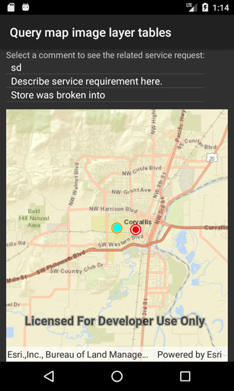

# Query map image layer tables

This sample demonstrates how to get a non-spatial table from an ArcGIS map image layer. It shows how to query such a table, as well as how to find related features in another table. The non-spatial tables contained by a map service may contain additional information about sublayer features. Such information can be accessed by traversing table relationships defined in the service.

## Instructions

1. Launch the sample, the map displays at the extent of the `Service Requests` layer.
2. The list is populated with service request comment records that have a valid(non-null) comment.
3. Select one of the service request comments from the list to see the related service request feature selected in the map.
