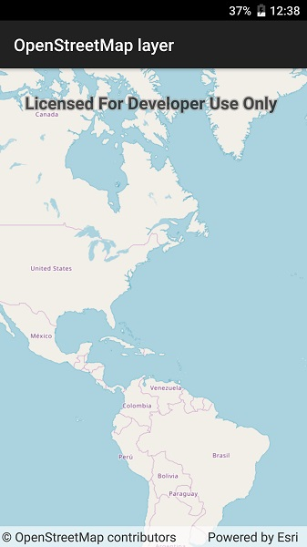

# OpenStreetMap layer

Add OpenStreetMap as a basemap layer.

## Use case

[OpenStreetMap](https://www.openstreetmap.org) is a free community-edited basemap.

## How it works

1. Create a basemap with the static method `Basemap.CreateOpenStreetMap`
2. Create a map with that basemap.
3. Show the map in a map view.

## Additional details

The attribution text will be set to the required OpenStreetMap attribution automatically. 

Apps that expect to make many requests to OpenStreetMap should consider using an alternative tile server via the `WebTiledLayer` class. See [Layer types described](https://developers.arcgis.com/net/latest/wpf/guide/layer-types-described.htm#ESRI_SECTION1_B995CCAB20584F91890B3614CF16CF43) for more information on OpenStreetMap usage restrictions and alternatives.

Esri now hosts an [OpenStreetMap vector layer](http://www.arcgis.com/home/item.html?id=3e1a00aeae81496587988075fe529f71) that uses recent OpenStreetMap data in conjunction with a style matching the default OpenStreetMap style. This layer is not subject to the tile access restrictions that apply to tiles fetched from OpenStreetMap.org. 

## Relevant API

* Map
* Basemap.CreateOpenStreetMap
* OpenStreetMapLayer
* Basemap
* MapView

## Tags

Layers, OpenStreetMap, OSM, basemap