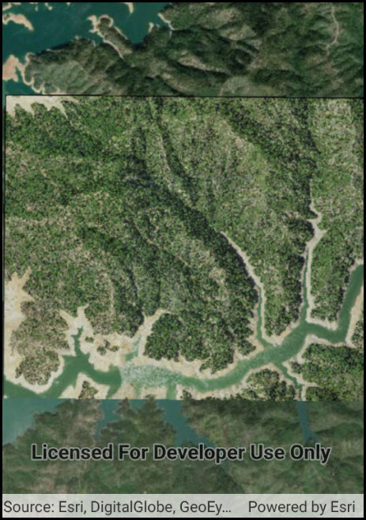

# Raster layer (file)

This sample demonstrates how to use a raster layer created from a local raster file.

## Instructions

The raster file is downloaded by the sample viewer automatically. Note that due to a known bug, this sample may crash in emulators running Android 4.4 (API level 19). All other platform versions are unaffected.
