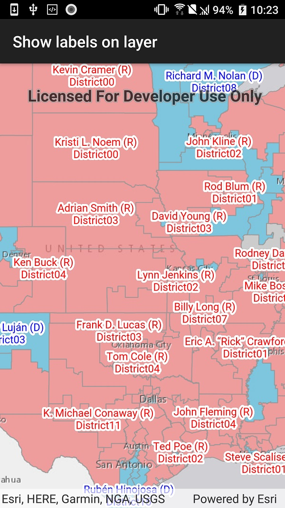

# Show labels on layer

This sample demonstrates how to show labels on a feature layer

## Instructions

The labeling of the names on the US Highways layer is accomplished by supplying a JSON string to the FeatureLayer's LabelDefinition. The JSON is based on the new ArcGIS web map specification.
