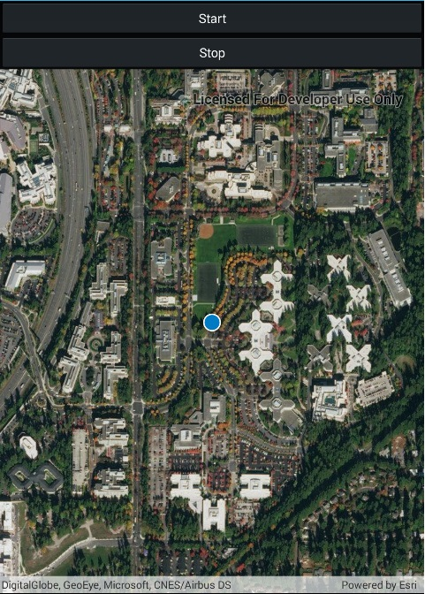

# Display device location

Display your current position on the map, as well as switch between different types of auto pan Modes.

## Use case

When using a map within a GIS, it may be helpful for a user to know their own location within a map, whether that's to aid the user's navigation or to provide an easy means of identifying/collecting geospatial information at their location.

## How to use the sample

Use the start and stop buttons to control location display. When you start location display, choose an auto pan mode from the dropdown menu.

## How it works

1. Create a `MapView`.
2. Get the `LocationDisplay` object by calling `getLocationDisplay()` on the map view.
3. Use `start()` and `stop()` on the `LocationDisplay` object as necessary.

## Relevant API

* Map
* LocationDisplay
* LocationDisplay.AutoPanMode
* MapView

## Additional information

Location permissions are required for this sample.

## Tags

MapViews SceneViews and UI, gps, mobile
