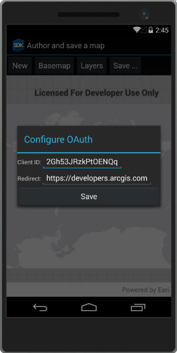

#Author a map

This samples demonstrates how to author and save a map as an ArcGIS portal item (web map). Saving a map to arcgis.com requires an ArcGIS Online login.

### Instructions

1. When the page initializes, input Client ID and Redirect URL OAuth settings (or accept the defaults). These settings are required in order to prompt the user to log in to ArcGIS Online.
2. Pan and zoom to the extent you would like for your map. 
3. Choose a basemap from the list of available basemaps. 
4. Choose one or more operational layers to include.
5. Click 'Save ...' to open the save dialog.
6. Provide info for the new portal item, such as a Title, Description, and Tags. 
7. Click 'Save'. 
8. After successfully logging in to your ArcGIS Online account, the map will be saved to your default folder. 
 
You can make additional changes, update the map, and then re-save to store changes in the portal item.

