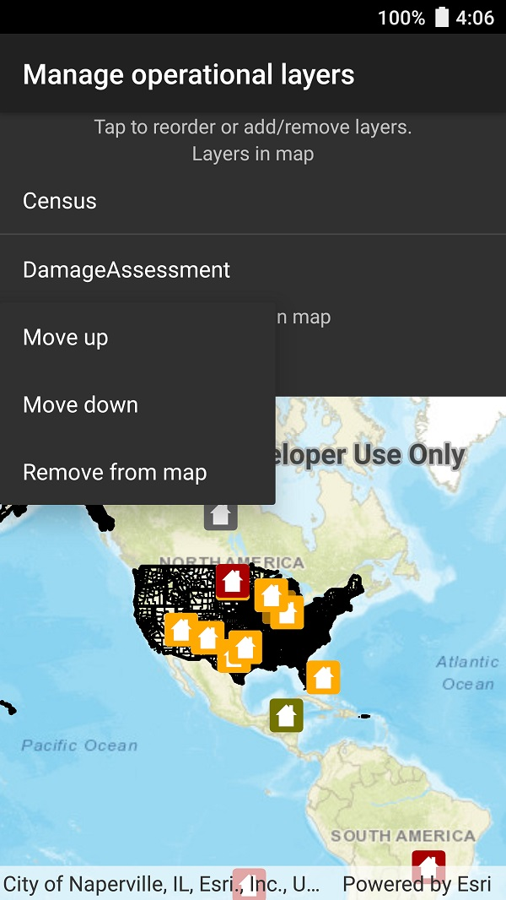

# Manage operational layers

Add, remove, and reorder operational layers in a map.

## How to use the sample

Tap a layer in a list to see a list of options. Select 'Move up' or 'Move down' to rearrange the layer within a list. Select 'Remove from map' or 'Add to map' to move the layer in or out of the map's operational layers.

## How it works

A map's `OperationalLayers` collection controls which layers are visualized. `MapView` automatically updates the visualization when the `Map` changes. A separate collection holds layers that have been removed from the operational layers. 

## Relevant API

* Map
* ArcGISMapImageLayer
* MapView
* MapView.OperationalLayers

## Tags

Map, scene, operational, hide, remove, add
