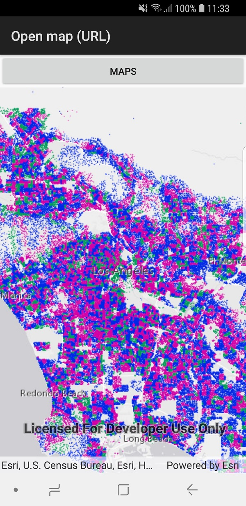

# Open map (URL)

This sample demonstrates how to open an existing map from a portal. The sample opens with a map displayed by default. You can change the shown map by selecting a new one from the populated list.

