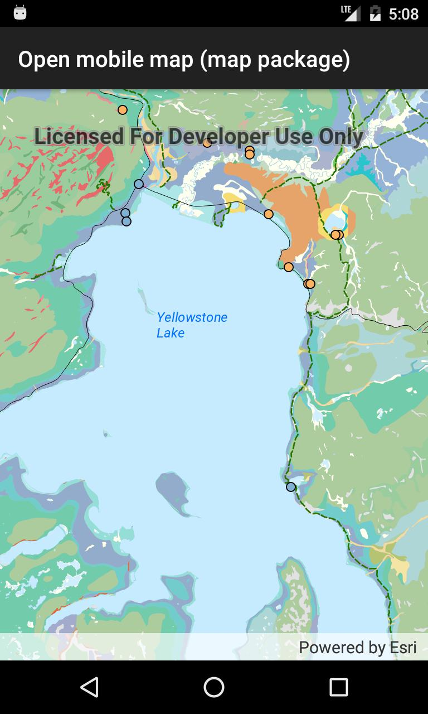

# Open mobile map package

Display a map from a mobile map package.

## Use case

An .mmpk file is an archive containing the data (specifically, basemaps and features) used to display an offline map.
A mobile map package may need to be unpacked to a directory to allow read support for certain data types.

## How it works

1. Create a `MobileMapPackage` specifying the path to the .mmpk file.
2. Use `MobileMapPackage.IsDirectReadSupportedAsync()` to check whether the package can be read in the archived form (.mmpk) or whether it needs to be unpacked.
3. If the mobile map package requires unpacking, call `MobileMapPackage.UnpackAsync()` and wait for this to complete.
4. Load the mobile map package with `mmpk.LoadAsync()`.
5. After it successfully loads, get the map from the .mmpk and add it to the map view.

## Relevant API

* MapView
* MobileMapPackage

## Tags

mmpk, mobile map package, offline
