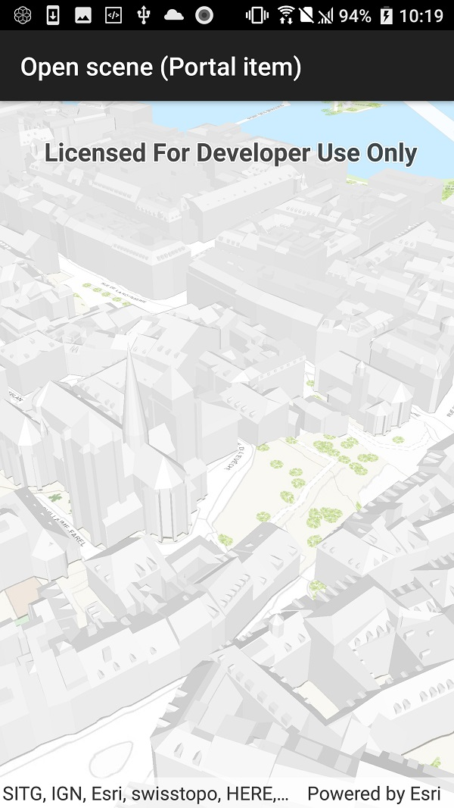

# Open scene (Portal item)

This sample demonstrates how to open a scene from a Portal item. Just like Web Maps are the ArcGIS format for maps, Web Scenes are the ArcGIS format for scenes. These scenes can be stored in ArcGIS Online or Portal.

## Instructions

The sample will load the scene automatically.
