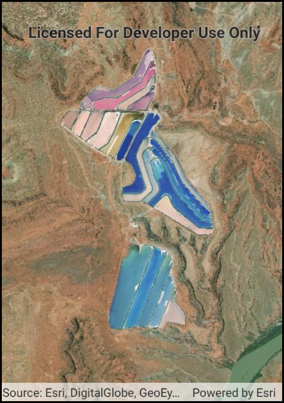

#Set initial map area

This sample demonstrates how to set the initial viewpoint from envelope defined by minimum (x,y) and maximum (x,y) values. The map's InitialViewpoint is set to this viewpoint before the map is loaded into the MapView. Upon loading the map zoom to this initial area.

### Instructions

