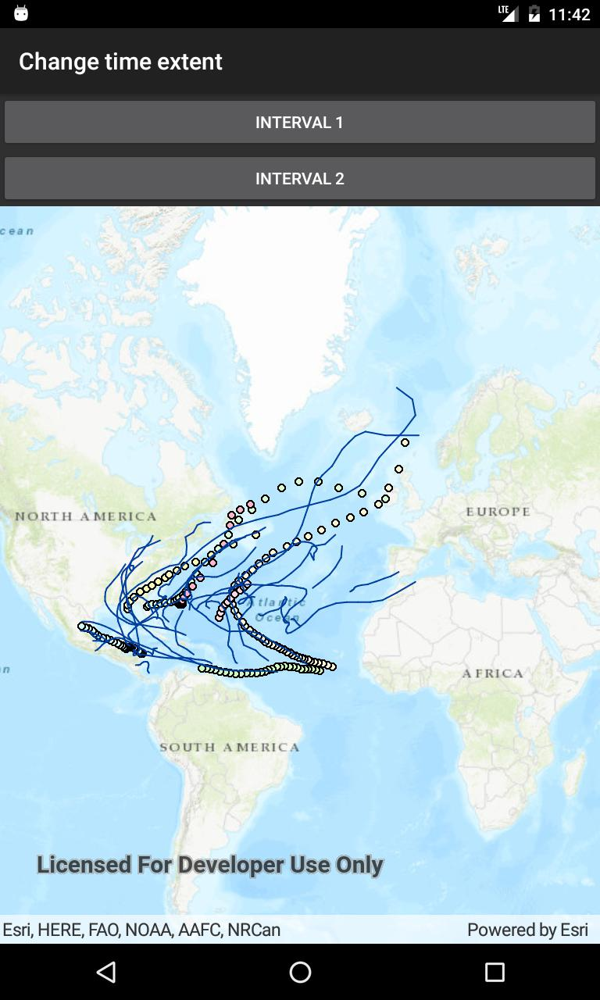

# Change time extent

This sample demonstrates how to filter data in layers by applying a time extent to a MapView.

## Instructions

Switch between the available options and observe how the data is filtered.
