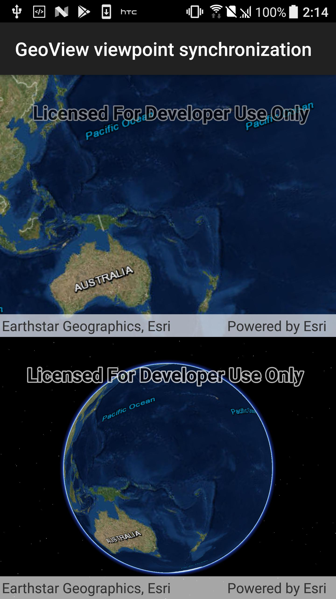

# GeoView viewpoint synchronization

Keep the view points of two views (a MapView and a SceneView in this case) synchronized with each other.

## Use case

A classic use case is the example of having two map views in one application. One inset map view displays all the layers at their full extent and contains a hollow rectangular graphic that represents the visible extent of the main map view. As the user zooms or pans in the main map view, the extent graphic in the inset map adjust accordingly.

## How to use the sample

Interact with either geo view (MapView or the SceneView) by zooming or panning, and the other geo view will automatically set the view point to be the same.

## How it works

1. Wire up the `ViewpointChanged` and `NavigationCompleted` event handlers for both geo views.
2. In each event handler, get the current viewpoint from the geo view that is being interacted with and then set the viewpoint of the other geo view to the same value.
3. Note: The reason for setting the view points in multiple event handlers is to account for the various types of interactions that can be occuring on the geo views (ie. single click pan -vs- continuous pan, single click zoom in -vs- mouse scroll wheel zoom, etc.).

## Relevant API

* GeoView
* GetCurrentViewPoint
* MapView
* GeoView.NavigationCompleted
* GeoView.ViewpointChanged
* SceneView
* SetViewPoint

## Tags

3D, GetCurrentViewpoint, MapView, SceneView, SetViewpoint, automatic refresh, event, event handler, events, extent, interaction, interactions, pan, sync, synchronize, zoom
