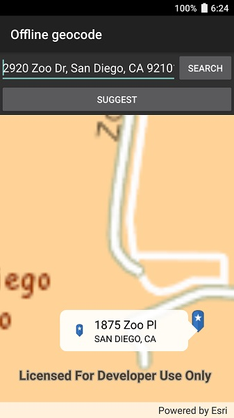

# Offline geocode

Geocode addresses to locations and reverse geocode locations to addresses offline.

## How to use the sample

Type the address click 'Search' or click 'Suggest' to choose from a list and view the result on the map. Tap the location you want to reverse geocode. Tap the pin to see the full address.

## How it works

1. Use the path of a .loc file to create a `LocatorTask` object.
2. Set up `GeocodeParameters` and call `GeocodeAsync` to get geocode results.

## Relevant API

* GeocodeParameters
* GeocodeResult
* LocatorTask
* ReverseGeocodeParameters

## Offline data

This sample downloads the following items from ArcGIS Online automatically:

* [streetmap_SD.tpk](https://www.arcgis.com/home/item.html?id=1330ab96ac9c40a49e59650557f2cd63) - Streets Tile Package (tpk) for the City of San Diego.
* [san-diego-locator.zip](https://www.arcgis.com/home/item.html?id=344e3b12368543ef84045ef9aa3c32ba) - Includes San Diego Locator Offline Dataset.

## Tags

Search and Query, geocode, geocoder, locator, offline, package
