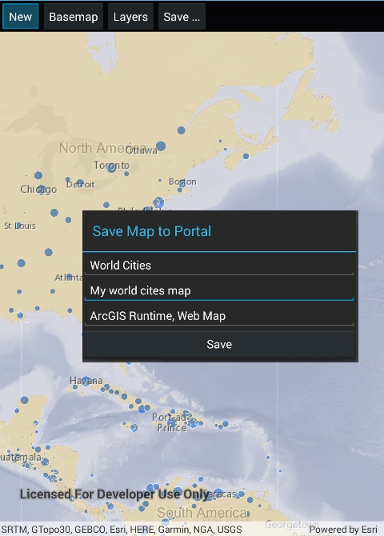

# Authenticate with OAuth

This sample demonstrates how to authenticate with ArcGIS Online (or your own portal) using OAuth2 to access a secure web map (or the secured layers it contains). Accessing secured items requires a login on the portal (an ArcGIS Online account, for example).

## Instructions

1. When you run the sample, the app will load a web map that contains premium content.
2. You will be challenged for an ArcGIS Online login to view that layer (world traffic).
3. Enter your ArcGIS Online user name and password.
4. If you authenticate successfully, the traffic layer will display, otherwise the map will contain only the public basemap layer.
5. You can alter the code to supply OAuth configuration settings specific to your app.
