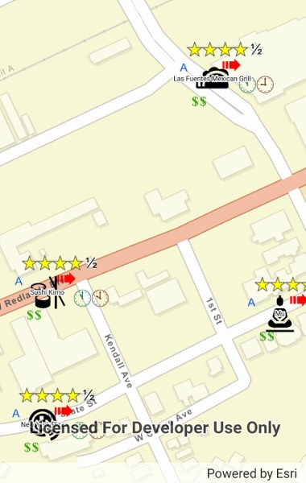

# Custom dictionary style

Use a custom dictionary style (.stylx) to symbolize features using a variety of attribute values.

## Use case

When symbolizing geoelements in your map, you may need to convey several pieces of information with a single symbol. You could try to symbolize such data using a unique value renderer, but as the number of fields and values increases, that approach becomes impractical. With a dictionary renderer you can build each symbol on-the-fly driven one or more several attribute values and handle a nearly infinite number of unique combinations.

## How to use the sample

Pan and zoom the map to see the symbology from the custom dictionary style.

## How it works

1. Create a new `DictionarySymbolStyle` by passing in the path to the custom style (.stylx).
2. Create a new `DictionaryRenderer`, providing the DictionarySymbolStyle.
3. Apply the dictionary renderer to a feature layer or graphics overlay with the expected attributes.

## Relevant API

* DictionaryRenderer
* DictionarySymbolStyle
* DictionarySymbolStyleConfiguration

## Offline data

This sample uses the Restaurant.stylx file, which can be found on [ArcGIS Online](https://arcgisruntime.maps.arcgis.com/home/item.html?id=751138a2e0844e06853522d54103222a).

## About the data

The layer showing a subset of [restaurants in Redlands, CA](https://services2.arcgis.com/ZQgQTuoyBrtmoGdP/arcgis/rest/services/Redlands_Restaurants/FeatureServer) with attributes for rating, style, health score, and open hours is symbolized using a dictionary renderer that displays a single symbol for all of these variables. The renderer uses symbols from a [custom dictionary style](https://arcgisruntime.maps.arcgis.com/home/item.html?id=751138a2e0844e06853522d54103222a) to show unique symbols based on several feature attributes. The symbols it contains were created using ArcGIS Pro. The logic used to apply the symbols comes from an Arcade script embedded in the stylx file (which is a SQLite database), along with a JSON string that defines expected attribute names and configuration properties.

## Additional Information

To learn more about how styles in dictionary renderers work, visit [Display symbols from a style with a dictionary renderer](https://master-dev.developers.arcgis.com/java/latest/guide/display-military-symbols-with-a-dictionary-renderer.htm). For information about creating your own custom dictionary style, see the open source [dictionary-renderer-toolkit](https://esriurl.com/DictionaryToolkit). 

## Tags

dictionary, military, renderer, style, stylx, unique value, visualization