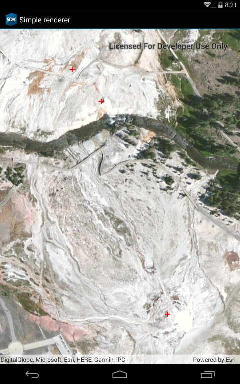

# Simple renderer

This sample demonstrates how to create a simple renderer and add it to a graphics overlay. Renderers define the symbology for all graphics in a graphics overlay (unless they are overridden by setting the symbol directly on the graphic). Simple renderers can also be defined on feature layers using the same code.

