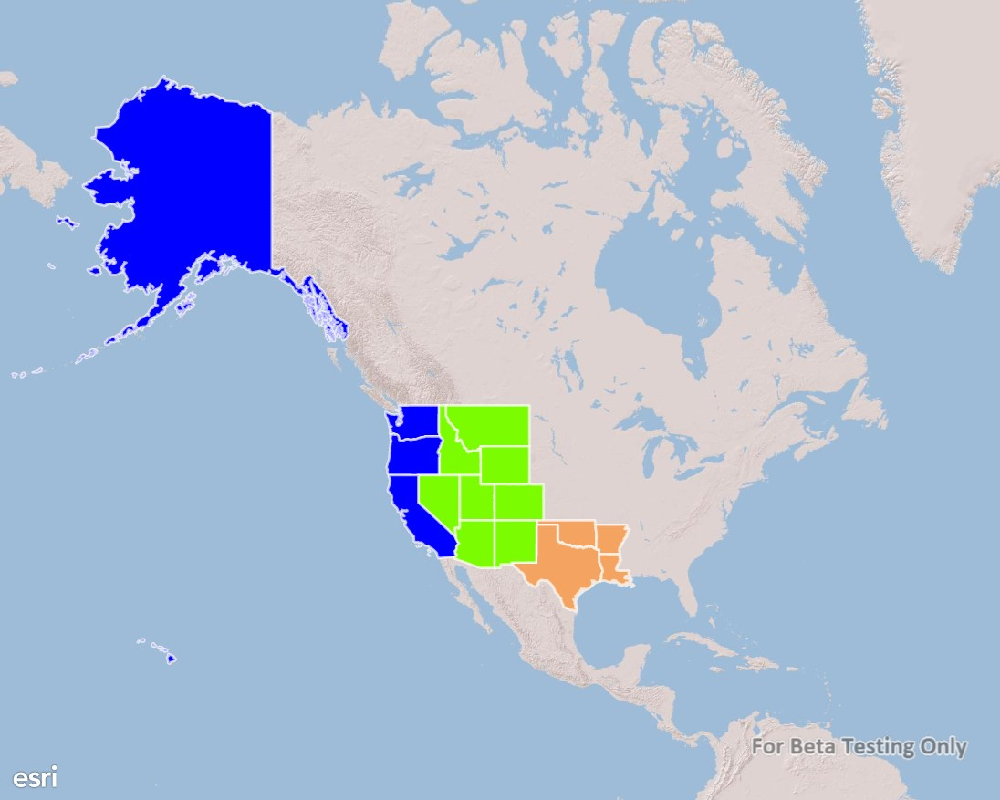

#Unique value renderer

This sample demonstrates how to use a unique value renderer to style different features in a feature layer with different symbols. Unlike graphics, features do not have a symbol property for you to set. Instead, renderers should be used to define the symbol for features in a feature layer. The unique value renderer allows for separate symbols to be used for features that have specific attribute values in a defined field.

### Instructions

