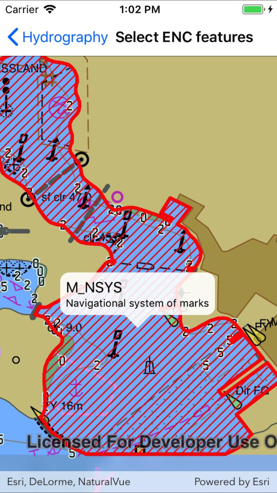

# Select ENC features

Select features in an ENC layer.

## Use case

You can use selection to identify a feature and learn more about it. ENC layers often have many overlapping features, and features of mixed geometry, in a single layer, so the sample includes code for identifying the smallest feature, which is taken to be the most relevant.

## How to use the sample

Tap to select ENC features. Feature properties will be displayed in a callout.

## How it works

1. Load and display the ENC layer.
2. When the map view is tapped, call `mapView.IdentifyLayersAsync()`, specifying the tapped position, a tolerance, and false for the `popupsOnly` parameter.
3. Filter the list of identified layers to include only results where the `LayerContent` is an `EncLayer`.
4. Get the first result with at least one feature.
5. Get the first feature in the `IdentifyLayerResult`.
6. Select that feature by calling `identifyResult.LayerContent.SelectFeature(firstFeature)`.
7. Show the feature's acronym and description in a callout.

## Relevant API

* EncFeature
* EncFeature.Acronym
* EncFeature.Description
* EncLayer
* GeometryEngine.Area
* IdentifyLayerResult
* IdentifyLayerResult.GeoElements
* IdentifyLayerResult.LayerContent

## Offline data

This sample downloads the following items from ArcGIS Online automatically:

* [ENC Exchange Set without updates](https://www.arcgis.com/home/item.html?id=9d2987a825c646468b3ce7512fb76e2d)

## About the data

The sample uses [ENC Exchange Set without updates](https://www.arcgis.com/home/item.html?id=9d2987a825c646468b3ce7512fb76e2d) a mock ENC data set, available on ArcGIS Online.

## Tags

chart, hydrography, identify, IHO, maritime, S-57, S57, select, selection