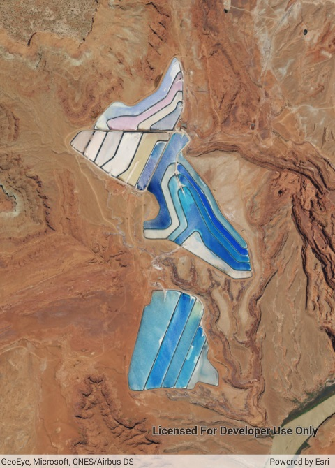

# Map initial extent

Display the map at an initial viewpoint representing a bounding geometry.

## Use case

Setting the initial viewpoint is useful when a user wishes to first load the map at a particular area of interest.

## How to use the sample

When the sample loads, note that the map view opens at the initial viewpoint defined on the map.

## How it works

1. Instantiate a `Map` object.
2. Instantiate a `Viewpoint` object using an `Envelope` object.
3. Set the starting location of the map with `map.InitialViewpoint`.
4. Set the map in the `MapView`.

## Relevant API

* Envelope
* Map
* MapView
* Point
* Viewpoint

## Tags

envelope, extent, initial, viewpoint, zoom
