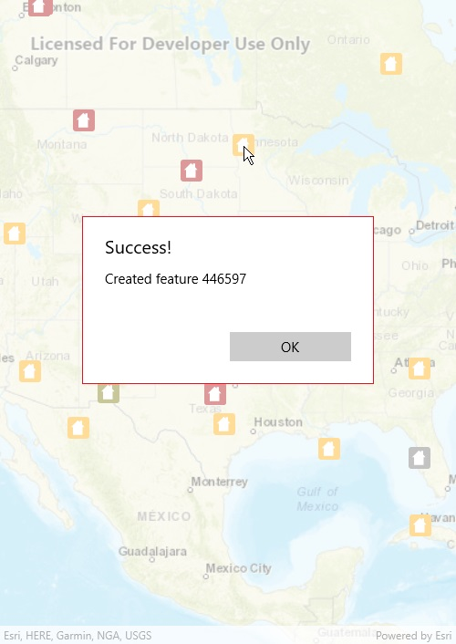

# Add features

Add features to a feature layer.

## Use case

An end-user performing a survey may want to add features to the map during the course of their work.

## How to use the sample

Tap on a location on the map to add a feature at that location.

## How it works

A `Feature` instance is added to a `ServiceFeatureTable` which then pushes that new feature to the server.

1. Create a `ServiceGeodatabase` from a URL.
2. Get a `ServiceFeatureTable` from the `ServiceGeodatabase`.
3. Create a `FeatureLayer` derived from the `ServiceFeatureTable` instance.
4. Create a `Feature` with attributes and a location using the `ServiceFeatureTable`.
5. Add the `Feature` to the `ServiceFeatureTable`.
6. *Apply edits* to the `ServiceGeodatabase` which will upload the new feature to the online service.

## Relevant API

* Feature
* FeatureEditResult
* FeatureLayer
* ServiceFeatureTable
* ServiceGeodatabase

## Additional Information

When editing feature tables that are subject to database behavior (operations on one table affecting another table), it's now recommended to call these methods (apply edits & undo edits) on the `ServiceGeodatabase` object rather than on the `ServiceFeatureTable` object. Using the `ServiceGeodatabase` object to call these methods will prevent possible data inconsistencies and ensure transactional integrity so that all changes can be commited or rolled back. 

## Tags

edit, feature, online service