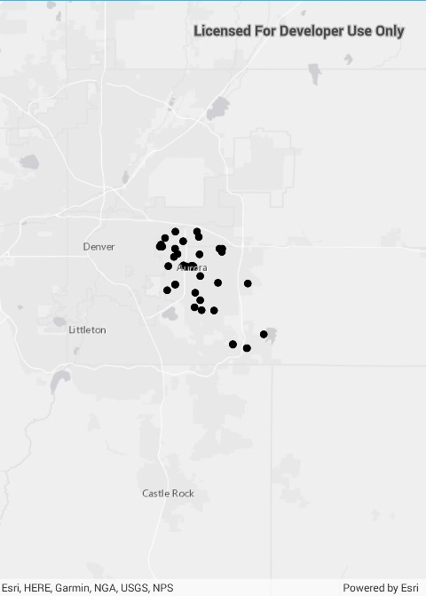

# Feature layer (GeoPackage)

This sample demonstrates how to open a GeoPackage and show a GeoPackage feature table in a feature layer.

## Instructions

The GeoPackage will be downloaded from an ArcGIS Online portal automatically.
