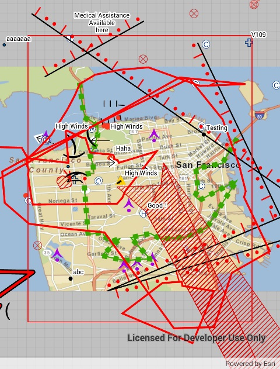

# Generate geodatabase

This sample demonstrates how to take a feature service offline by generating a geodatabase.

## Instructions

1. Pan and zoom to the area you would like to download features for, ensuring that all features are within the rectangle.
2. Tap on the button. This will start the process of generating the offline geodatabase.
3. Observe that the sample unregisters the geodatabase. This is best practice when changes won't be edited and synced back to the service.

Note that the basemap will be automatically downloaded from an ArcGIS Online portal.
