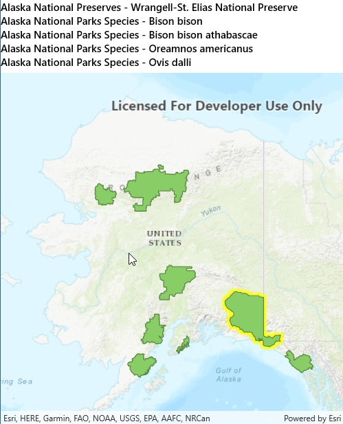

# List related features

This sample demonstrates how to query features related to an identified feature.

## Instructions

Click on a feature to identify it. Related features will be listed in the window above the map.
