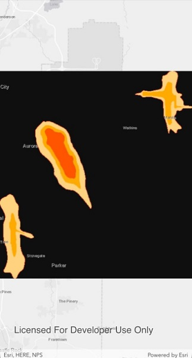

# Raster layer (GeoPackage)

This sample demonstrates how to open a GeoPackage and show a GeoPackage raster in a raster layer.

## Instructions

The GeoPackage will be downloaded from an ArcGIS Online portal automatically.
