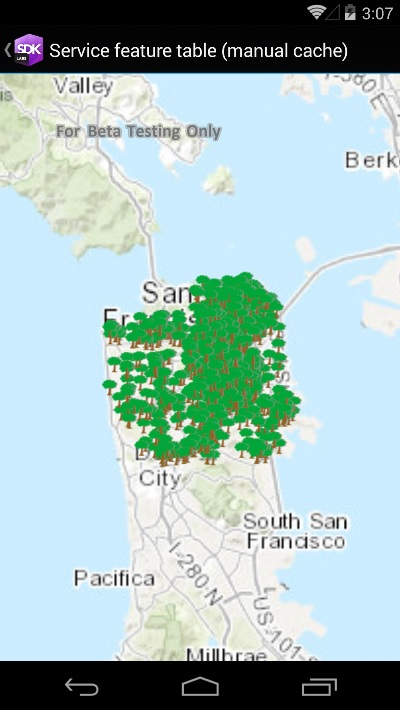

# Service feature table (manual cache)

Display a feature layer from a service using the **manual cache** feature request mode.

## Use case

`ServiceFeatureTable` supports three request modes, which define how features are requested from the service and stored in the local table. The feature request modes have different performance characteristics. Use **manual cache** in scenarios where you want to explicitly control requests for features.

## How to use the sample

Run the sample and pan and zoom around the map. Observe the features loaded from the table.

## How it works

1. Set the `ServiceFeatureTable.FeatureRequestMode` property of the service feature table to `ManualCache` before the table is loaded.
2. Load the table.
3. Call `PopulateFromServiceAsync` on the table to request features.

## Relevant API

* FeatureLayer
* FeatureRequestMode.ManualCache
* ServiceFeatureTable
* ServiceFeatureTable.PopulateFromServiceAsync
* ServiceFeatureTable.FeatureRequestMode

## About the data

The sample uses [a feature service showing pool permits](https://sampleserver6.arcgisonline.com/arcgis/rest/services/PoolPermits/FeatureServer/0) for land parcels in a Riverside, CA neighborhood.

## Additional information

In **manual cache** mode, features are never automatically populated from the service. All features are loaded manually using calls to `PopulateFromServiceAsync`.

## Tags

cache, feature request mode, performance