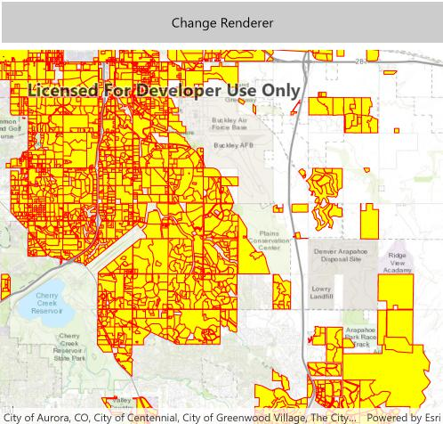

# Symbolize a shapefile

Display a shapefile with custom symbology.

## Use case

While feature layers come with default symbology, you can apply custom styling to ensure that the content is visible and usable in the context of a specific map.

## How it works

1. Create a `ShapefileFeatureTable`, providing the path to a shapefile.
2. Create a `FeatureLayer` and associate it with the `ShapeFileFeatureTable`.
3. Create a `SimpleRenderer` to override the default symbology. The simple renderer takes a symbol and applies that to all features in a layer.
4. Apply the renderer to the `FeatureLayer` by setting the renderer.

## Relevant API

* FeatureLayer
* ShapefileFeatureTable
* SimpleFillSymbol
* SimpleLineSymbol
* SimpleRenderer

## Offline data

This sample downloads the following items from ArcGIS Online automatically:

* [Aurora_CO_shp.zip](https://www.arcgis.com/home/item.html?id=d98b3e5293834c5f852f13c569930caa) - Shapefiles that cover Aurora Colorado: Public art (points), Bike trails (lines), and Subdivisions (polygons).

## About the data

This sample displays a shapefile containing subdivisions in Aurora, CO.

## Tags

package, shape file, shapefile, symbology, visualization
