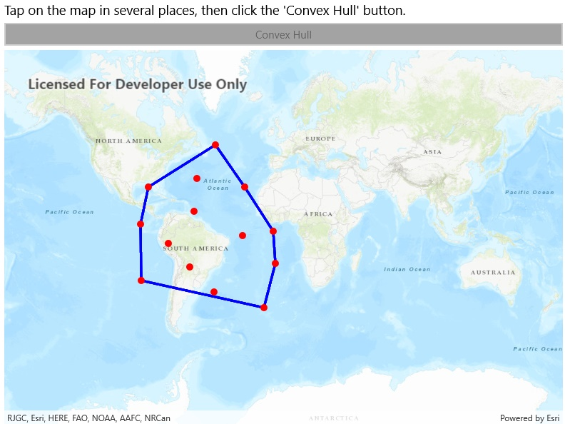

# Convex hull

This sample demonstrates how to use the GeometryEngine.ConvexHull operation to generate a polygon that encloses a series of user-tapped map points.

## Instructions

Tap on the map in several places, then click the 'Convex Hull' button.
