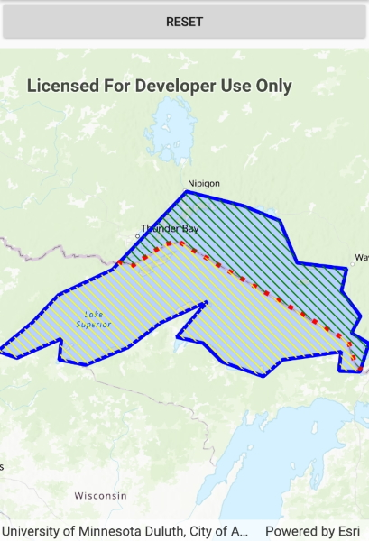

# Cut geometry

This sample demonstrates how to cut a geometry with a polyline using the GeometryEngine.

## Instructions

Click the 'Cut' button to cut the polygon with the polyline and see the resulting parts.
