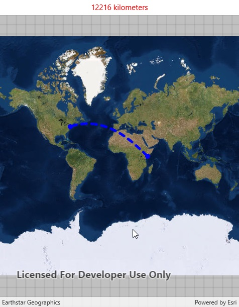

# Geodesic operations

This sample demonstrates how to perform geodesic operations on geometries using the GeometryEngine. Geodesic calculations take into account the curvature of the Earth, while planar calculations are based on a 2D Cartesian plane.

## Use case

Visualizing flight paths between cities is a common example of a geodesic operation--notice the lines are not straight, but curved. A geodesic distance must be calculated to get an accurate real world distance between two points on a 2D map.

## How to use the sample

1. Click anywhere on the map. A line graphic will display the geodesic line between the two points. In addition, text that indicates the geodesic distance between the two points will be updated.
2. Click elsewhere and a new line will be created.

## How it works

1. A `Point` is created in New York City and displayed as a `Graphic`.
2. When a click occurs on the `MapView`, a new `Point` is obtained from the mouse click. This `Point` is added as a `Graphic`.
3. A `Polyline` is created with the two `Point` objects.
4. `GeometryEngine.DensifyGeodetic` is executed by passing in the `Polyline` object, and the returned `Geometry` is added as a `Graphic`.
5. `GeometryEngine.LengthGeodetic` is executed by passing in the two `Point` objects, and the returned number is displayed on the screen.

## Relevant API

* GeometryEngine.DensifyGeodetic
* GeometryEngine.LengthGeodetic

## Tags

GeometryEngine, densify, distance, geodesic, geodetic
