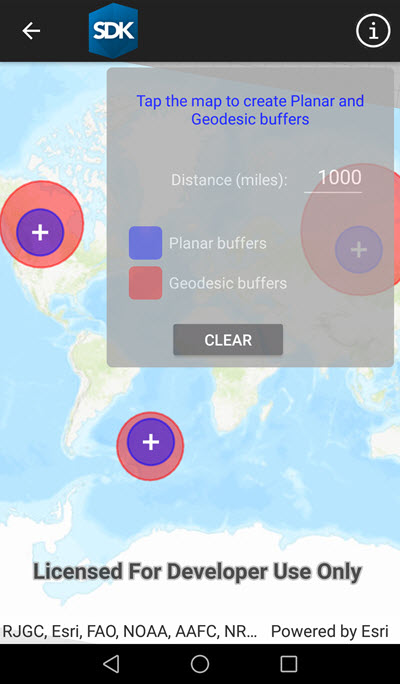

# Buffer

This sample demonstrates how to use the GeometryEngine.Buffer to generate a polygon from an input geometry with a buffer distance.

## Instructions

Tap on the map to specify a map point location. A buffer will created and displayed based upon the buffer value (in miles) specified in the textbox. Repeat the procedure to add additional map point and buffers. The generated buffers can overlap and are independent of each other.
