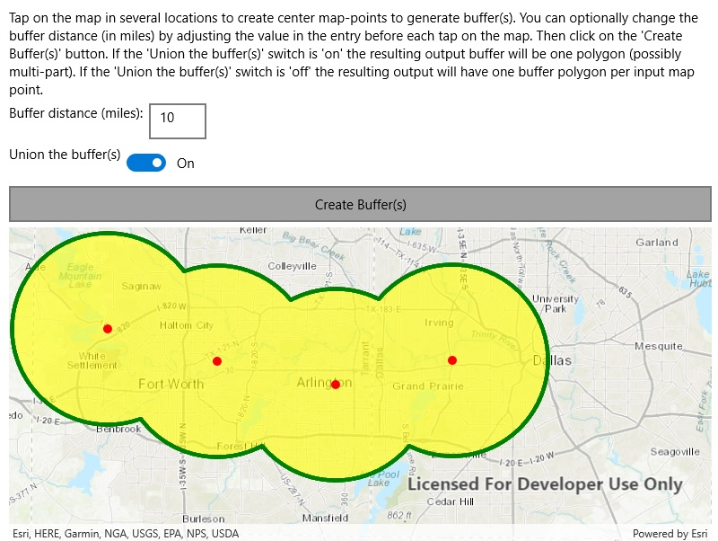

# Buffer list

This sample demonstrates how to use the GeometryEngine.Buffer to generate one or more polygon from a series of input geometries and matching series of buffer distances. The option to union all the resulting buffer(s) is provided.

## Instructions

Tap on the map in several locations to create center map-points to generate buffer(s). You can optionally change the buffer distance(in miles) by adjusting the value in the entry before each tap on the map. Then click on the 'Create Buffer(s)' button. If the 'Union the buffer(s)' swicth is 'on' the resulting output buffer will be one polygon(possibly multi - part). If the 'Union the buffer(s)' switch is 'off' the resulting output will have one buffer polygon per input map point.
