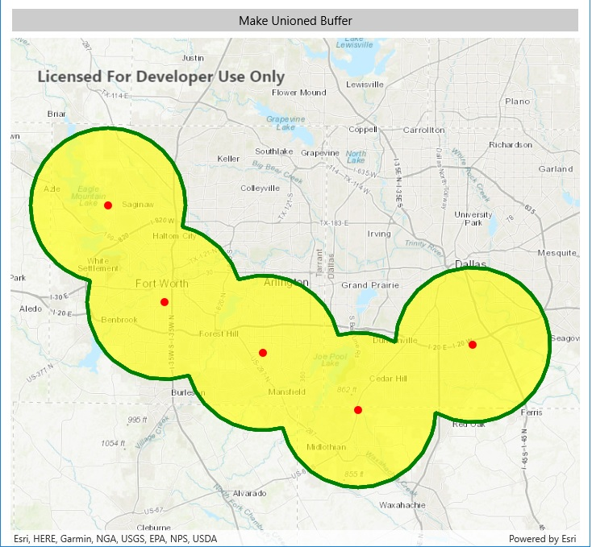

# Buffer with Union

This sample demonstrates how to use the GeometryEngine.Buffer to generate a union polygon from a series of input geometries and matching series of buffer distances.

## Instructions

Tap on the map in several locations to specify a series of map points. Then click on the 'Make a Unioned Buffer' button. A unioned polygon will be created and displayed. It is possible that the polygon generated will have multiple parts depending on the spatial dispersion of the input map points.
